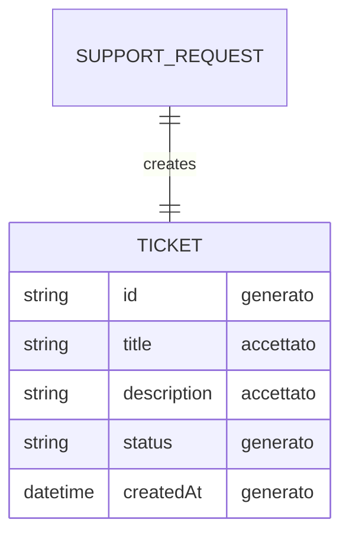

# Data Sketch - Create Ticket

## Prima Di Compilare

Un data sketch è una classificazione dei campi prima dello schema definitivo.

Serve a decidere quali dati sono accettati, generati, respinti o ancora mancanti.

Il Mermaid finale visualizza solo campi e relazioni gia' motivati nella tabella.

Non usare questo file per progettare tutto il database o accettare campi non collegati a issue e contract.

## Come Scegliere Lo Stato Del Campo

| Stato | Usalo quando | Domanda di controllo |
| --- | --- | --- |
| accettato | il campo arriva dall'input e serve al primo slice | chi lo inserisce? |
| generato | il sistema crea il valore | quando viene creato? |
| respinto | il campo è fuori scope o non motivato | quale vincolo lo esclude? |
| mancante | il campo potrebbe servire, ma manca una decisione | chi deve chiarirlo? |

Se non sai motivare un campo, non metterlo nel Mermaid: lascialo `mancante` o `respinto`.

## Scopo

Classificare i dati prima di chiedere codice.

## Campi

| Campo | Stato | Motivo | Fonte |
| --- | --- | --- | --- |
| `title` | accettato | Campo obbligatorio inserito dal supporto; senza titolo il ticket non è identificabile | issue / contract |
| `description` | accettato | Campo obbligatorio inserito dal supporto; descrive il problema da risolvere | issue / contract |
| `id` | generato | Identificatore univoco creato dal sistema alla creazione del ticket | contract / decisione |
| `status` | generato | Il sistema imposta "open" alla creazione; il client non può impostarlo | contract / decisione |
| `createdAt` | generato | Timestamp di creazione generato dal sistema; non accettato come input | contract / decisione |
| `priority` | mancante | Potrebbe servire, ma manca l'insieme dei valori accettati e chi li assegna | decisione |
| `area` | respinto | Non motivato dalla issue; allargherebbe lo scope | issue (fuori scope) |
| `attachments` | respinto | Fuori scope | contract |
| `owner` | respinto | Fuori scope | contract |

## Mermaid Leggero

Usa Mermaid solo per visualizzare la relazione minima. Non trasformarlo in schema DB definitivo.

Campi mostrati nel diagramma:

- `id` - generato
- `title` - accettato
- `description` - accettato
- `status` - generato
- `createdAt` - generato

## Campi Scartati O Rimandati

| Campo | Decisione | Motivo |
| --- | --- | --- |
| `area` | respinto | Non motivato dalla issue; allargherebbe lo scope del primo slice |
| `attachments` | respinto | Fuori scope |
| `owner` | respinto | Fuori scope |
| `priority` | rimandato | Potrebbe servire in uno slice successivo, ma manca decisione su valori e fonte |

## Domande Per L07

- [quale file potrebbe contenere questi dati?]
- [quale naming andra' verificato nella repo?]
- [quale campo dipende da una decisione non presa?]
