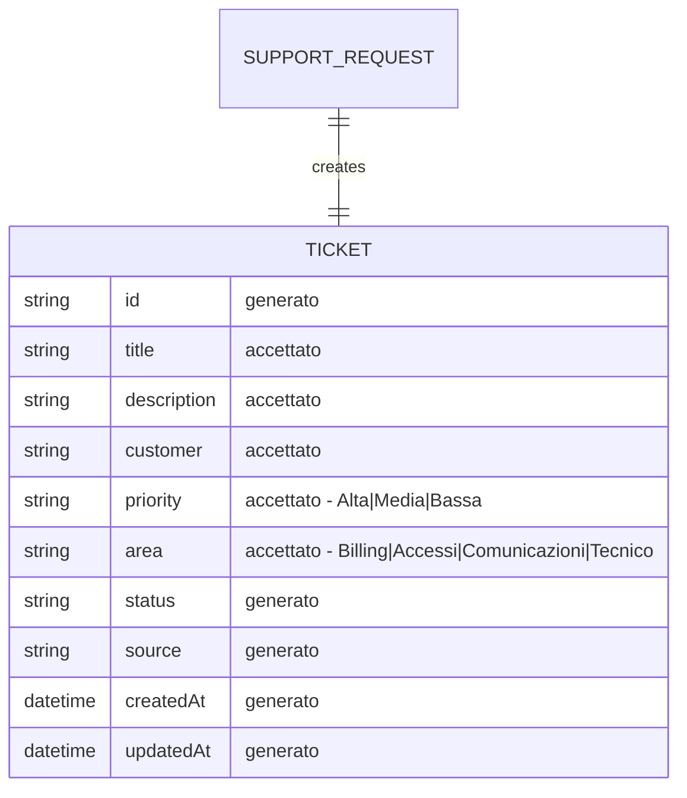

# Data Sketch - Create Ticket

## Prima Di Compilare

Un data sketch è una classificazione dei campi prima dello schema definitivo.

Serve a decidere quali dati sono accettati, generati, respinti o ancora mancanti.

Il Mermaid finale visualizza solo campi e relazioni gia' motivati nella tabella.

Non usare questo file per progettare tutto il database o accettare campi non collegati a issue e contract.

## Come Scegliere Lo Stato Del Campo

| Stato | Usalo quando | Domanda di controllo |
| --- | --- | --- |
| accettato | il campo arriva dall'input e serve al primo slice | chi lo inserisce? |
| generato | il sistema crea il valore | quando viene creato? |
| respinto | il campo è fuori scope o non motivato | quale vincolo lo esclude? |
| mancante | il campo potrebbe servire, ma manca una decisione | chi deve chiarirlo? |

Se non sai motivare un campo, non metterlo nel Mermaid: lascialo `mancante` o `respinto`.

## Scopo

Classificare i dati prima di chiedere codice.

## Campi

| Campo | Stato | Motivo | Fonte |
| --- | --- | --- | --- |
| `title` | accettato | Campo obbligatorio inserito dal supporto; senza titolo il ticket non è identificabile | issue / contract |
| `description` | accettato | Campo obbligatorio inserito dal supporto; descrive il problema da risolvere | issue / contract |
| `customer` | accettato | Identifica l'organizzazione o azienda che ha aperto la richiesta | repo / tickets.js |
| `priority` | accettato | Priorità del ticket; valori ammessi definiti in `allowedPriorities`: Alta, Media, Bassa | repo / tickets.js |
| `area` | accettato | Categoria funzionale del ticket; valori ammessi definiti in `allowedAreas`: Billing, Accessi, Comunicazioni, Tecnico | repo / tickets.js |
| `id` | generato | Identificatore univoco creato dal sistema alla creazione del ticket | contract / decisione |
| `status` | generato | Il sistema imposta "open" alla creazione; il client non può impostarlo | contract / decisione |
| `source` | generato | Il sistema imposta "support" per le richieste dal canale supporto; non accettato come input | repo / decisione |
| `createdAt` | generato | Timestamp di creazione generato dal sistema; non accettato come input | contract / decisione |
| `updatedAt` | generato | Timestamp dell'ultimo aggiornamento generato dal sistema; uguale a createdAt alla creazione | repo / decisione |
| `attachments` | respinto | Fuori scope | contract |
| `owner` | respinto | Fuori scope | contract |

## Mermaid Leggero

Usa Mermaid solo per visualizzare la relazione minima. Non trasformarlo in schema DB definitivo.

Campi mostrati nel diagramma:

- `id` - generato
- `title` - accettato
- `description` - accettato
- `customer` - accettato
- `priority` - accettato (Alta | Media | Bassa)
- `area` - accettato (Billing | Accessi | Comunicazioni | Tecnico)
- `status` - generato
- `source` - generato (sempre "support" per questo flusso)
- `createdAt` - generato
- `updatedAt` - generato

## Campi Scartati O Rimandati

| Campo | Decisione | Motivo |
| --- | --- | --- |
| `attachments` | respinto | Fuori scope |
| `owner` | respinto | Fuori scope |

## Domande Per L07 - Risolte

- `allowedPriorities` e `allowedAreas` sono in `server/data/tickets.js`; il naming e' confermato nella repo.
- `source` e `updatedAt` non richiedono decisione: sono generati automaticamente dal server.
- Tutti i campi accettati sono ora motivati dalla struttura reale del ticket.
