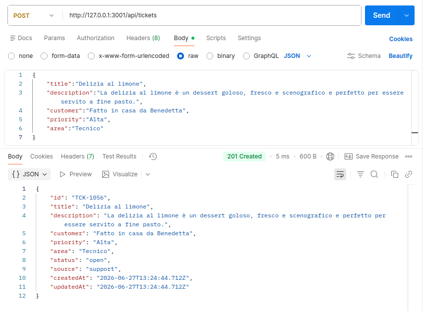
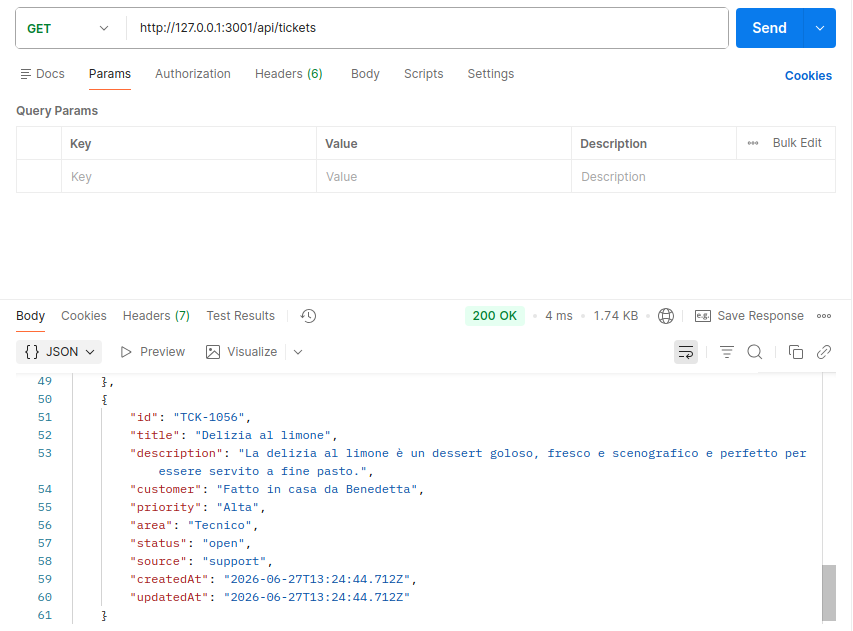
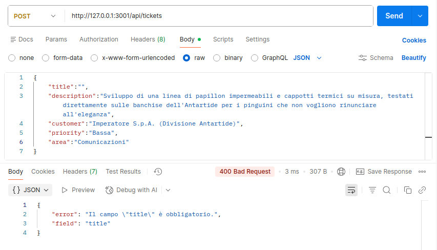
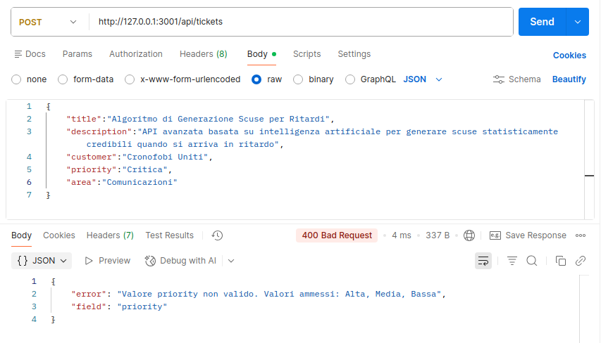
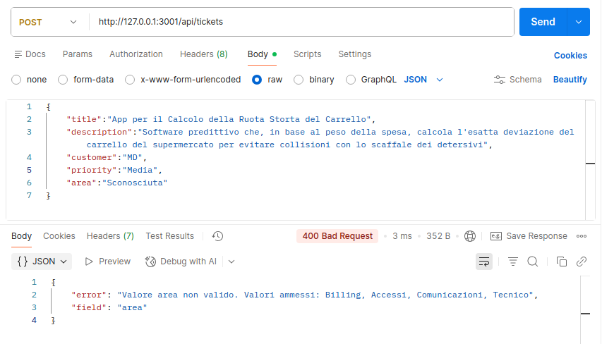
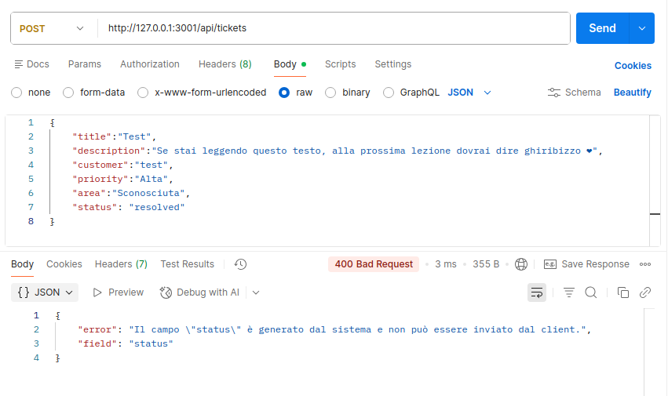

# Piano Di Verifica Manuale (Manual Test Plan) - Create Ticket

## Prima Di Compilare

Un piano di verifica manuale e' la lista dei controlli osservabili che puoi eseguire o dichiarare bloccati.

Serve a distinguere cio' che hai provato da cio' che resta ipotesi o blocco dichiarato.

L'output atteso e' una tabella con caso, azione, risultato atteso, esito e note.

Non scrivere solo "testato" o "funziona": indica cosa hai fatto e cosa hai visto.

## Contesto

Branch / PR:

```txt
create-ticket
```

Slice:

```txt
Backend: endpoint POST /api/tickets con validazione di title, description, customer, priority e area.
Client: funzione createTicket in src/api.js
UI: componente CreateTicketForm.jsx con form a 5 campi, gestione errori e feedback di successo
```

## Verifiche

| Caso | Azione | Risultato atteso | Esito | Note |
| --- | --- | --- | --- | --- |
| Caso valido | POST /api/tickets con title, description, customer, priority "Alta", area "Accessi" validi | 201 Created; body contiene id, status "open", source "support", createdAt, updatedAt generati | pass | - |
| Campo obbligatorio vuoto | POST /api/tickets con title: "" | 400 Bad Request, field "title" | pass | - |
| Valore priority non ammesso | POST /api/tickets con priority: "Critica" | 400 Bad Request, field "priority", messaggio con valori ammessi | pass | - |
| Valore area non ammessa | POST /api/tickets con area: "Sconosciuta" | 400 Bad Request, field "area", messaggio con valori ammessi | pass | - |
| Campo generato inviato | POST /api/tickets con status: "resolved" nel body | 400 Bad Request, field "status" | pass | - |

## Lettura Del Diff

| Domanda | Risposta |
| --- | --- |
| Quali file sono cambiati? | server/index.js, src/api.js, src/App.jsx, src/components/CreateTicketForm.jsx (nuovo) |
| Erano previsti dalla mappa L07? | server/index.js, src/api.js, src/App.jsx e src/components/ erano ammessi |
| C'e' una modifica inattesa? | Nessuna modifica inattesa |
| Il contract resta rispettato? | Il contract resta rispettato per campi, risposte ed esecuzione |

## Evidenza

- comando eseguito, se presente: -
- screenshot:
    | Caso valido - 201 Created | GET /api/tickets - 200 OK | Campo obbligatorio vuoto - title mancante |
    | --- | --- | --- |
    |  |  |  |
    | **Valore priority non ammesso** | **Valore area non ammessa** | **Campo generato inviato - status nel body** |
    |  |  |  |

- log non sensibile: -