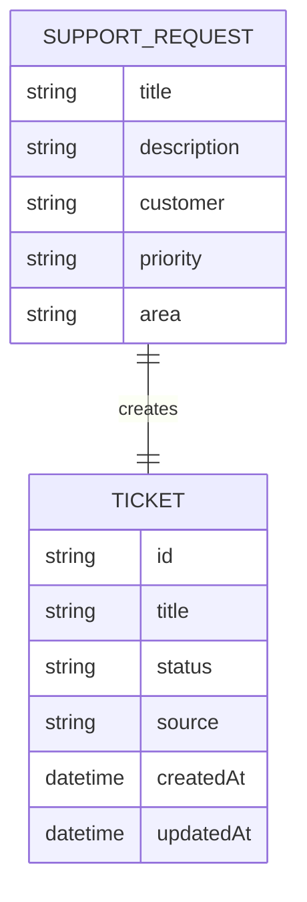

# Data Sketch - Create Ticket

## Scopo

Classificare i campi del primo slice prima di chiedere codice.

Non e' uno schema database definitivo.

## Campi

| Campo | Stato | Motivo | Fonte |
| --- | --- | --- | --- |
| `title` | accettato | Serve a identificare il problema segnalato | issue / contract |
| `description` | accettato | Aggiunge contesto alla richiesta supporto | contract |
| `customer` | accettato | Collega il ticket al cliente segnalato dal supporto | assunzione operativa |
| `priority` | accettato | Serve alla triage minima e deve usare valori ammessi | contract |
| `area` | accettato | Aiuta a classificare la richiesta | contract |
| `id` | generato | Identificativo del ticket creato | sistema |
| `status` | generato | Il primo slice crea ticket aperti | decisione |
| `source` | generato | `support` deriva dal task e non dal login | decisione |
| `createdAt` | generato | Timestamp tecnico di creazione | sistema |
| `updatedAt` | generato | Timestamp tecnico iniziale uguale o coerente con la creazione | sistema |
| `reporterId` | respinto | Richiederebbe auth o utente autenticato | fuori scope |
| `owner` | respinto | Ownership avanzata fuori scope | fuori scope |
| `attachments` | respinto | Allegati fuori scope | fuori scope |
| `notifyCustomer` | respinto | Notifiche fuori scope | fuori scope |

## Mermaid Leggero

## Campi Scartati O Rimandati

| Campo | Decisione | Motivo |
| --- | --- | --- |
| `reporterId` | respinto | Auth fuori scope |
| `owner` | respinto | Owner avanzato fuori scope |
| `attachments` | respinto | Allegati fuori scope |
| `notifyCustomer` | respinto | Notifiche fuori scope |

## Domande Per L07

- Dove sono definiti i valori ammessi per `priority`?
- Dove sono definiti i valori ammessi per `area`?
- `POST /api/tickets` esiste gia' come stub o va creato?
